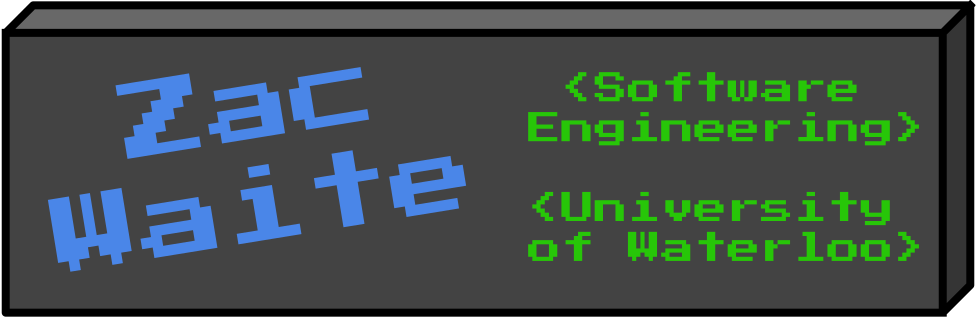
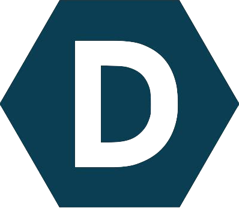

#  Hi, I’m Zac Waite (@zrwaite)

*Software Engineering student at the University of Waterloo. Coder/web developer, VEX Worlds participant, Orillia Citizen of the Year Nominee.*

---
### 👀 I am interested in web development, my forté being in javascript.  
* I also have good experience with PHP, Python, and C++
* Some experience with Java, C# and C.
* I have skills in Node/Express, Docker, MongoDB, Hosting, and system architecture.

### I have participated in several coding competitions, such as the CCC, game jams, and hackathons. 
* 1st Place Covid Prize 🥇 - Def Hacks Worldwide 3.0: "[Capacity Controller](https://devpost.com/software/capacity-controller)"
* 1st Place 🥇 - ULHacks: "[Followthru](https://devpost.com/software/followthru-0cr35p)"
* 3rd Place 🥉 - Skills Ontario Web Design and Development 2021
* Participant 🏅 - Hack The North 2021: "[CartTech](https://devpost.com/software/carttech)"

---

## 🌱 I’m currently learning ... 

##  How to reach me/find out more ...
<table width="100%">
    <tr>
        <td>
            <a href="mailto:129032699zw@gmail.com">
                 Email
            </a>
        </td>
        <td>
            <a href="https://www.linkedin.com/in/zac-waite/">
                 LinkedIn
            </a>
        </td>
        <td>
            <a href="https://devpost.com/zrwaite">
                 Devpost
            </a>
        </td>
    </tr>
</table>
<!--Contact form-->

<!-- Personal Website -->

<!--

-->