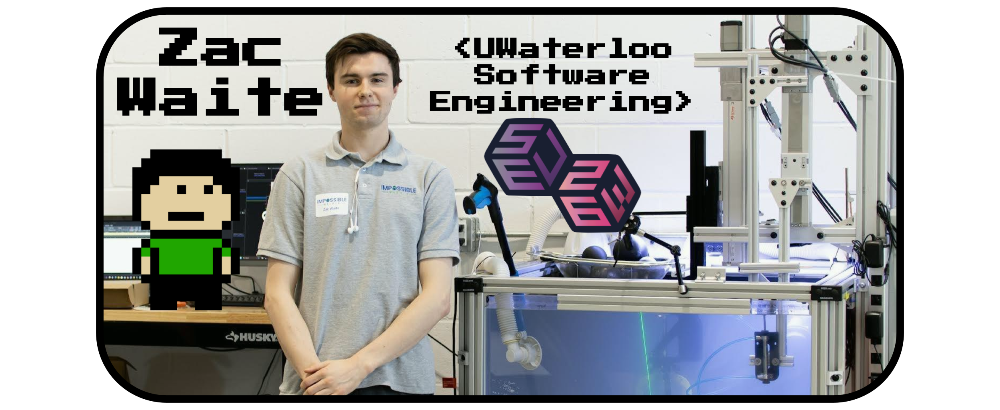

##  Software Engineering @ UWaterloo

## 💻 Full Stack Web and Robotics Programmer ⚙️

### ⭐ ***Open to web and app development contract opportunities*** ⭐

---

# Languages, Tools, and Technologies

 

---

# 📊 Programming Stats

---

-   ## [🟦 LinkedIn](https://www.linkedin.com/in/zac-waite/)
-   ## [⌨️ Devpost](https://devpost.com/zrwaite)
-   ## [🌐 Website](https://insomnizac.xyz)
-   ## [📄 Resume](https://insomnizac.xyz/resume)

---

# 🏆 Coding Competitions:

-   ## 1st Place Covid Prize 🥇 - Def Hacks: "[Capacity Controller](https://devpost.com/software/capacity-controller)"
-   ## 1st Place 🥇 - ULHacks: "[Followthru](https://devpost.com/software/followthru-0cr35p)"
-   ## DigitalOcean Prize 🥇 - FreyHacks: "[SumFun](https://devpost.com/software/sumfun)"

---

