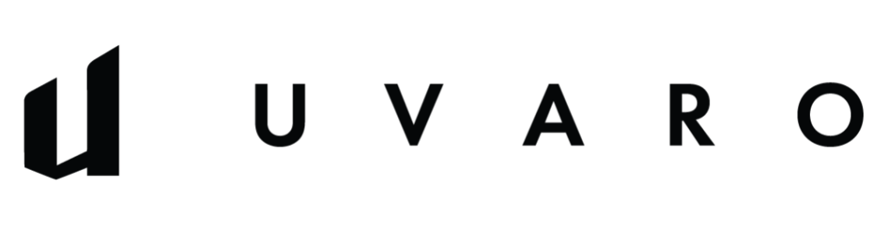
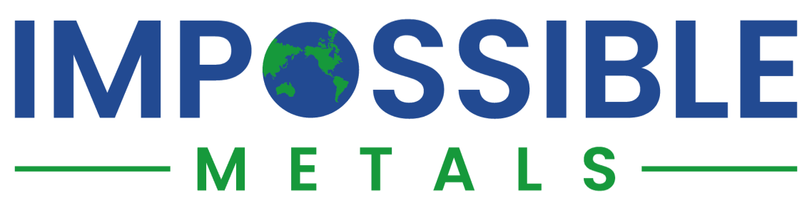
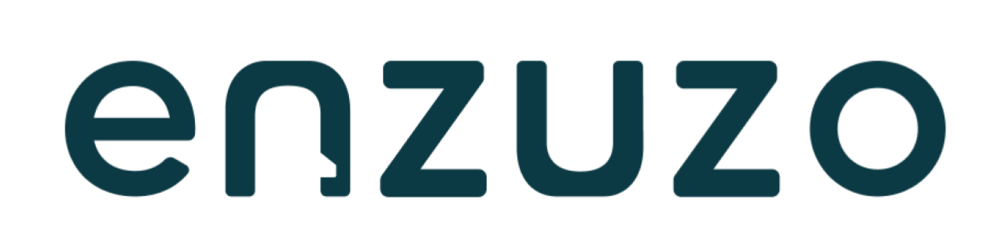
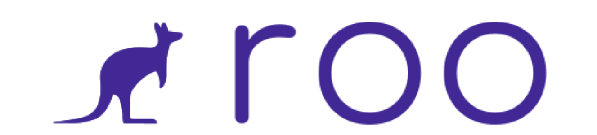

##  Software Engineering @ UWaterloo

## 💻 Cloud/Web Software, Firmware, Control Systems Engineer ⚙️

### AI Services Full Stack Engineer @ United Nations OPS

### Former SWE @ Uvaro, Impossible Metals, Enzuzo, Roo.vet, SWRIL, Base Power Company

---

# Languages, Tools, and Technologies

 

